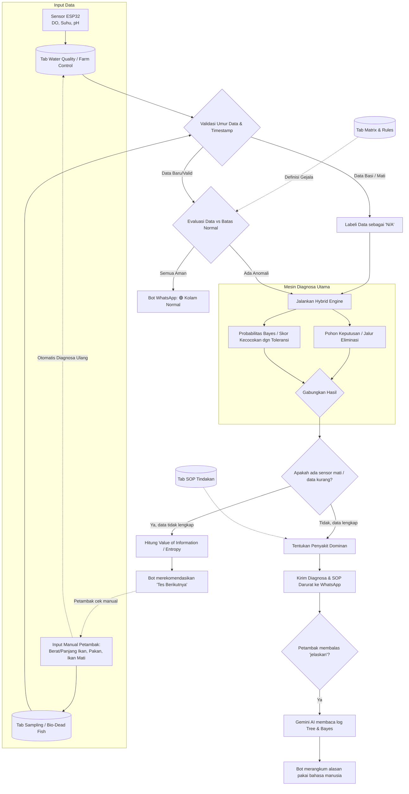

# BIOFLOK Diagnostic Optimizer — Workflow Lengkap
## Spreadsheet + Apps Script + Chatbot WA + UI Config + Simulasi

---

# PENDAHULUAN: ARSITEKTUR JURNAL "DUAL-BRAIN DIAGNOSTICS"

Sistem BIOFLOK yang dikembangkan sepenuhnya berlandaskan pada arsitektur **Hybrid Clinical Decision Support System** yang tervalidasi oleh literatur akademis. Konfigurasi ini mendayagunakan konsep *"Dual-Brain Diagnostics"* melalui 4 Pilar Utama:

### PILAR 1: Konsep "Database Hidup" (D-Matrix / CBR)
*   **Teori Akademis:** Mengonversi *flowchart* diagnosa tradisional yang kaku menjadi *Case-Based Reasoning* (CBR) berupa matriks dua dimensi (*Diagnostic Matrix* / D-Matrix).
*   **Implementasi Bioflok:** Tab `Matrix Diagnosis` berfungsi penuh sebagai D-Matrix. Angka 1 berarti PASS, 0 berarti FAIL, dan *blank* berarti tes tidak relevan. Seluruh aturan *hardcode* ("Jika DO < 4.0") diurai ke dalam sel matriks agar pakar perikanan dapat menambah/mengedit secara mandiri tanpa menyentuh *code* Python.

### PILAR 2: Otak Paralel (Bayesian Inference via GAS)
*   **Fungsi:** Deteksi pasif yang memproses data sensor IoT (ESP32) secara *real-time*.
*   **Teori Akademis:** Menggunakan Jaringan Probabilitas (Bayesian) yang menangani ketidakpastian data (fluktuasi sensor). Menghitung probabilitas setiap penyakit berdasarkan *Prior* (frekuensi) dan *Likelihood* menggunakan rumus Log-Odds.
*   **Implementasi Bioflok:** File `Diagnosis_Engine.gs` memanggil nilai sensor, mengevaluasi rules, dan melakukan *scoring* Bayesian secara paralel. Sistem memperhitungkan **False Alarm Rate**, menghasilkan persentase probabilitas tangguh (*Confidence Score*), bukan sekadar stempel "Ya" / "Tidak".

### PILAR 3: Otak Sekuensial (ID3 & Value of Information via **Google Apps Script**)
*   **Fungsi:** Bertindak sebagai *Penanya Cerdas (Copilot)* saat ada data sensor yang mati atau belum di-_input_ oleh manusia.
*   **Teori Akademis:** Memanfaatkan Algoritma *ID3 (Decision Tree/Shannon Entropy)* untuk membangun cabang pohon evaluasi secara dinamis berdasarkan kalkulasi *Information Gain*. Sistem tidak mengevaluasi sensor secara kaku dari atas ke bawah, melainkan mencari *"Sensor mana yang paling cepat memangkas kemungkinan penyakit?"*. 
*   **Perilaku Unik Pohon (Breaker / Halter):** Jika mesin Pohon sedang menelusuri cabang lalu menemui sensor yang datanya mati / Kosong (N/A), maka ranting pohon tersebut **TIDAK BISA dilanjutkan (Terputus)**. Berbeda dengan *Bayesian* yang bisa melompati data kosong. Saat Pohon terputus inilah, sistem memanggil *Value of Information (VOI)* untuk menyuruh petambak mengecek manual parameter N/A tersebut.
*   **Implementasi Bioflok:** File `DiagnosticTree.gs` dihidupkan untuk membongkar pasang logis pohon secara utuh pada Apps Script, meletakkan Pilar 3 di awan (Google). Jika sewaktu-waktu Server Python Anda mati, sistem AI ini tidak akan cacat! Python murni diturunkan pangkatnya hanya menjadi sekadar *Messenger* ke WhatsApp.

### PILAR 4: Sinkronisasi State & Caching
*   **Fungsi:** Membangun *Stateful Server*.
*   **Implementasi Bioflok:** Node server Python bekerja dengan memori silih-berganti berpatokan pada nomor WhatsApp (*Stateful per Number*). Strategi **Caching** aktif: Memori `Diagnosis_Rules` dari Sheets akan di-cache selama 24 jam (karena jarang berubah di pertengahan siklus), guna mencegah beban berlebih (*Rate Limit*) saat menarik data pembacaan IoT yang selalu *fresh*.

Seluruh cetak biru dan arsitektur di atas merajut fondasi paling kokoh sesuai standar keilmuan mutakhir.

### Diagram Alur Berpikir (Workflow Arsitektur)
Berikut adalah visualisasi bagaimana mesin kita bekerja dari ujung ke ujung:



---

# BAGIAN 1: KONFIGURASI SPREADSHEET (DATABASE)

## Tab yang Sudah Ada (Tidak Diubah)
- `Water Quality` — data sensor ESP32 (DO, pH, Suhu, TDS)
- `Farm Control` — status perangkat (AC, Blower, Feeder)
- `Diagnosis_Rules` — pusat pemetaan data (atur Parameter, Keyword, dan **Tab Source** / sumber tab data tanpa ganti kode)
- `Matrix Diagnosis` — definisi gejala per penyakit + baris Cost
- `Diagnosis History` — riwayat diagnosa lama

### Layout Spreadsheet: Tab `SOP Tindakan`
*(Kedua tabel ini berada di dalam satu sheet yang sama, dipisahkan oleh satu kolom kosong di Kolom H)*

| A: Nama Penyakit 🔽 | B: Level 🔽 | C: Waktu (mnt) | D: Tindakan 1 | E: Tindakan 2 | F: Tindakan 3 | G: Tindakan 4 | **H (Pemisah)** | I: Nama Parameter 🔽 | J: Cara Cek Manual |
| :--- | :--- | :--- | :--- | :--- | :--- | :--- | :---: | :--- | :--- |
| Plankton Crash | CRITICAL | 30 | Tambah aerasi darurat | Stop pakan | Water change 20% | Hubungi pakar | `\|` | Transparansi Air | Gunakan Secchi disk: Hilang < 20cm (Crash), > 40cm (Aman) |
| Low DO Murni | WARNING | 60 | Cek/bersihkan blower | Nyalakan kincir | - | - | `\|` | Kematian Ikan | Kelilingi kolam, serok ikan yang mengapung |
| *[Pilih dari List]* | | | | | | | `\|` | *[Pilih dari List]* | |

**Penjelasan Fungsi:**
*   **Kolom A (Nama Penyakit) & Kolom I (Nama Parameter):** Dilengkapi fitur **Auto-Dropdown**. List pilihan diambil langsung dari `Matrix Diagnosis`.
*   **Kolom B (Level):** Dilengkapi dropdown statis (INFO, WARNING, CRITICAL).
*   **Kolom A-G (Panduan Penyakit):** Mendefinisikan langkah darurat *per penyakit*.
*   **Kolom I-J (Panduan Manual):** Edukasi petambak cara mengecek parameter / sensor yang gagal/mati.

> Keunggulan: Admin hanya perlu ke satu tab ini untuk mengatur "apa yang harus dilakukan" (SOP) dan "bagaimana cara ngeceknya" (Manual Check).

## Tab Baru: `Sensor & Alarm`
Berfungsi sebagai rapor kesehatan kolam dan daftar sensor riil (terpisah dari rule diagnosa penyakit). Chatbot akan membaca tab ini ketika ditanya kondisi normal / report harian.

| Nama Tampilan Bot | Lokasi Tab | Teks Header (Keyword) | Aman Min | Aman Max | Satuan | Pesan Alarm Khusus |
| :--- | :--- | :--- | :--- | :--- | :--- | :--- |
| **Kadar Oksigen (DO)** | Water Quality | DO | 4.0 | 8.0 | mg/L | ⚠️ Aerasi bermasalah! |
| **Suhu Air** | Water Quality | Temp | 26.0 | 32.0 | °C | ⚠️ Suhu ekstrem! |
| **Kadar pH** | Water Quality | pH | 6.5 | 8.5 | | ⚠️ Air terlalu asam/basa! |
| **Pompa Blower Utama**| Farm Control | Blower | ON | ON | | 🚨 Blower mati! |

## Tab Baru: `Konfigurasi Bot`
| Parameter | Nilai | Keterangan |
|-----------|-------|------------|
| algo_mode | eff | id3 / voi / eff |
| false_alarm_rate | 0.05 | Toleransi kesalahan sensor agar diagnosa tidak langsung 0% jika ada 1 data meleset (0-0.5) |
| min_confidence_alert | 70 | Min % untuk kirim notif ke petambak |
| notif_pakar_threshold | 85 | Min % untuk auto-notif pakar |
| tree_max_depth | 6 | Batas kedalaman tree |
| diagnosis_interval_min | 30 | Jeda menit antar auto-diagnosa |
| enable_tree_mode | TRUE | TRUE/FALSE — tampilkan jalur tree |
| enable_bayes_mode | TRUE | TRUE/FALSE — tampilkan probabilitas |
| enable_sop | TRUE | TRUE/FALSE — tampilkan tindakan |
| enable_voi_recommendation | TRUE | TRUE/FALSE — tampilkan rekomendasi tes |
| sensor_timeout_min | 30 | Timeout sensor sebelum dianggap mati (menit) |
| manual_timeout_min | 1440 | Timeout input manual (misal: ikan mati) |
| python_webhook_url | https://ngrok-anda.app/alert | URL endpoint server Python untuk menerima alarm |
| ai_provider | gemini | Agen LLM yang dipakai (gemini / openai / claude) |
| ai_api_key | AIzaSy.... | Token Rahasia (API Key) untuk diakses Python Bot |

> 💡 **INFO FLEKSIBILITAS KODE (Tanpa Hardcode)**
> Filosofi utama arsitektur ini adalah **Pemisahan Logika & Konfigurasi**.
> Seluruh pengaturan perilaku *"Otak AI"*, termasuk angka toleransi kesalahan (`false_alarm_rate`), rentang jeda waktu Cronjob (`diagnosis_interval_min`), alamat IP Server (*`python_webhook_url`*), bahkan hingga Tipe Agen AI (*`ai_api_key`*), sengaja DITARIK KELUAR dari dalam *Script Code* dan diletakkan sepenuhnya pada Spreadsheet ini. 
> 
> Keunggulannya sangat masif: 
> 1. **URL Webhook (Ngrok):** Benci sekali saat alamat link Ngrok Anda mati/restart dan Anda harus meraba-raba skrip kode untuk mencari mana yang perlu diganti? Kini Anda cukup blok dan ganti link Ngrok di sel Excel kolom `python_webhook_url`. Google (GAS) akan otomatis menggunakan link yang baru ditempel untuk menembak *(POST)* server Anda!
> 2. **AI Provider & API Key:** Ingat analogi *Taksi Online*, **`ai_provider`** adalah *"Nama Perusahaannya"* (Gemini atau OpenAI) agar aplikasi Python tahu bahasa pemrograman apa yang sedang dikontaknya. Sedangkan **`ai_api_key`** adalah *"Sandi Password Anda"* untuk masuk ke server perusahaan tersebut. Apabila besok Anda bosan dengan gaya bahasa AI Gemini dan melihat ChatGPT (OpenAI) mengeluarkan versi yang jauh lebih pintar, Anda **TIDAK PERLU** repot-repot membongkar kodifikasi Python. Anda murni hanya perlu mengubah nilai sel `ai_provider` di Excel menjadi `openai`, lalu menempelkan *API Key* OpenAI yang baru. *Selesai!* Bot WA berubah otak seketika. Sangat *Plug-and-Play*!

## Tab Baru: `Tree Diagnosis Result`
| Timestamp | Diagnosa | Conf (%) | Depth | Cost | Step 1 | Step 2 | Step 3 | Step 4 |
|-----------|----------|----------|-------|------|--------|--------|--------|--------|
| 14/03/2026 04:00 | Plankton Crash | 92.5 | 4 | 5 | Low DO (PASS) | High Temp (PASS) | Blower Off (FAIL) | High pH (FAIL) |
| 14/03/2026 04:30 | Kondisi Normal | 100 | 1 | 1 | Low DO (FAIL) | - | - | - |
| 14/03/2026 05:00 | Low DO Murni | 85.0 | 3 | 4 | Low DO (PASS) | High Temp (FAIL) | Blower Off (PASS) | - |

Riwayat khusus mode Tree, terpisah dari Diagnosis History biasa agar admin bisa audit jalur berpikir algoritma.

## Perubahan Minor: `Matrix Diagnosis`
Update baris Cost dari semua-1 ke nilai realistis sesuai kemudahan pengecekan di lapangan.

---

# BAGIAN 2: GOOGLE APPS SCRIPT

## File Baru: `DiagnosticTree.gs`

### Fungsi Utama:

**`getMatrixForTree(ss)`** — baca Matrix Diagnosis dari Sheets, konversi ke format yang sama dengan HTML tool.

**`calculateEntropy(items)`** — copy paste dari HTML tool. Hitung Shannon Entropy.

**`calculateCostSensitiveGain(items, fIdx, fName, cost, algo)`** — copy paste dari HTML tool. Hitung gain dibagi cost sesuai mode algo.

**`buildDiagnosisTree(items, features, depth, cost, path, algo, maxDepth)`** — copy paste dari HTML tool. Bangun pohon secara rekursif.

**`traverseTree(tree, snapshot)`** — fungsi baru. Telusuri pohon berdasarkan snapshot PASS/FAIL. Return jalur lengkap.

**`calcVOI(snapshot, matrixData)`** — hitung parameter mana yang paling informatif untuk dicek jika ada sensor mati.

**`calculateConfidence(diagName, trace, matrixItems, headers)`** — hitung berapa persen definisi penyakit cocok dengan jalur tree.

## File Baru (Opsional): `BayesLogOdds.gs`

**`runBayesLogOdds(snapshot, matrixData, falseAlarmRate)`** — upgrade dari `_matchMatrix()`. Pakai Log-Odds update dengan toleransi false alarm sensor.

## File Update: `Diagnosis_Engine.gs`

Tambah fungsi baru (tidak menghapus yang lama):

**`runCombinedDiagnosis(overrideSnapshot)`** — fungsi utama yang menggabungkan Tree + Bayes + SOP + VOI. Kalau overrideSnapshot dikirim → mode simulasi. Kalau null → mode production (baca sensor asli).

**`getSOPForDiagnosis(ss, diagnosisName)`** — baca tab SOP Tindakan.

**`getBotConfig(ss)`** — baca tab Konfigurasi Bot.

## File Update: `Simulator.gs`

Update simulator yang sudah ada menjadi dialog HTML interaktif:
- Tampilkan dropdown PASS/FAIL per parameter (dibaca dinamis dari Diagnosis_Rules)
- Admin pilih nilai sesuka hati, klik "Jalankan"
- Panggil `runCombinedDiagnosis(overrideSnapshot)` dengan input dari dialog
- Hasil muncul di popup (Tree + Bayes + SOP)
- Tidak simpan ke History
- Tombol "Ubah Input" untuk kembali ke form dan coba lagi

## File Update: `API_Endpoint.gs`

Tambah case baru:
- `run_combined_diagnosis` — jalankan diagnosa lengkap (Tree + Bayes + SOP + VOI)
- `get_bot_config` — return semua config
- `update_config` — update satu nilai di Konfigurasi Bot
- `update_sop` — update satu baris di SOP Tindakan
- `update_threshold` — update threshold di Diagnosis_Rules

## File Update: `Menu_Utama.gs`

## 2.4 Menu Ekstensi Baru & Korelasi Wajah UI (Satu Otak, Dua Wajah)

> 💡 **KORELASI CHATBOT WA & UI HTML**
> Sering muncul pertanyaan: *"Apakah hal-hal yang bisa dilakukan lewat Chatbot WA bisa dilakukan juga lewat UI HTML di Spreadsheet?"*
> **Jawabannya: SANGAT BISA! Bahkan UI HTML jauh lebih canggih.**
> 
> Sistem ini menganut arsitektur **Sentralisasi Engine (Satu Otak, Dua Wajah)**:
> *   **Otaknya cuma satu:** Yaitu file `Diagnosis_Engine.gs` (Google Apps Script).
> *   **Wajah 1 (Chatbot WA):** Layar antarmuka untuk *Petambak Lapangan* (Praktis, tangan berlumpur, berbasis ketikan teks singkat).
> *   **Wajah 2 (UI HTML Spreadsheet):** Layar antarmuka / *Command Center* untuk *Pakar/Admin* di depan Laptop. Anda cukup menekan tombol `[▶️ JALANKAN DIAGNOSA]` di Layar HTML, maka sistem akan mengeksekusi rumus yang *sama persis* dengan jika petambak mengetik `/diagnosa` di WA. Keunggulannya: Layar HTML menampilkan visualisasi yang jauh lebih interaktif (Progress Bar, Simulasi Data Palsu, dll) tanpa mengotori memori riwayat WA.

Menu kustom baru di Google Sheets (di toolbar atas):
```javascript
function onOpen() {
  SpreadsheetApp.getUi()
    .createMenu('🐟 BIOFLOK SYSTEM')
    .addItem('🎛️ Buka Control Panel', 'openControlPanel')
    .addToUi();
}

function openControlPanel() {
  const html = HtmlService.createHtmlOutputFromFile('ControlPanel')
    .setWidth(500).setHeight(600)
    .setTitle('🐟 BIOFLOK Control Panel');
  SpreadsheetApp.getUi().showModalDialog(html, '🐟 BIOFLOK Control Panel');
}
```

### File Baru: `ControlPanel.html` (di dalam GAS project)

Dialog HTML yang muncul saat klik menu. Semua fitur lama + baru ada di satu tampilan:

```
┌──────────────────────────────────────────────────┐
│  🐟 BIOFLOK SYSTEM — Control Panel              │
│                                                  │
│  ┌── 🔬 DIAGNOSA ──────────────────────────────┐ │
│  │ [▶️ Jalankan Diagnosa]  [🧪 Simulasi]       │ │
│  │ [📋 Lihat Tree]        [💻 AI Simulator]    │ │
│  └──────────────────────────────────────────────┘ │
│                                                  │
│  ┌── ⚙️ PENGATURAN DIAGNOSA ───────────────────┐ │
│  │ Algoritma:  (●) Efficiency  ( ) VOI  ( ) ID3│ │
│  │ ☑ Tree Mode   ☑ Bayes Mode   ☑ SOP          │ │
│  │ False Alarm Rate:  [0.05]                    │ │
│  │ Min Confidence:    [70  ]                    │ │
│  │                       [💾 Simpan Pengaturan] │ │
│  └──────────────────────────────────────────────┘ │
│                                                  │
│  ┌── 📊 DASHBOARD ─────────────────────────────┐ │
│  │ [📊 Dashboard FCR]      [🔄 Sync Data]     │ │
│  └──────────────────────────────────────────────┘ │
│                                                  │
│  ┌── 🗃️ DATABASE & RULES ──────────────────────┐ │
│  │ [🗃️ Database Manager] (Add/Delete)           │ │
│  │ [📥 Matrix→Rules]  [📤 Rules→Matrix]        │ │
│  │ [📁 Export CSV]    [🔧 Refresh Dropdown]    │ │
│  │ [🔗 Setup Keyword 2&3] [🏷️ Header Logic]   │ │
│  └──────────────────────────────────────────────┘ │
│                                                  │
│  ┌── 🔧 MAINTENANCE ───────────────────────────┐ │
│  │ [🪄 Template FCR]  [🔁 Sync Header]        │ │
│  │ [🗑️ Reset History]                          │ │
│  └──────────────────────────────────────────────┘ │
│                                                  │
│                              [Tutup]             │
└──────────────────────────────────────────────────┘
```

Setiap tombol panggil fungsi GAS via `google.script.run`:
- Toggle/radio langsung update tab `Konfigurasi Bot`
- Tombol diagnosa panggil `runCombinedDiagnosis()` dan tampilkan hasil di panel
- Tombol simulasi buka form dropdown PASS/FAIL lalu tampilkan hasil (tidak simpan)
- **[🗃️ Database Manager]**: Membuka modal khusus (yang sudah ada di `Rule2Matrix.gs`) untuk menambah/menghapus parameter dan penyakit secara permanen dari semua tab.

---

# BAGIAN 2.5: DETAIL ALUR KERJA CONTROL PANEL (UI Interaction)

Berikut adalah rincian "apa yang terjadi" saat tombol di Control Panel diklik:

### 1. Group: 🔬 DIAGNOSA
*   **[▶️ Jalankan Diagnosa]**:
    - GAS baca sensor asli (`Water Quality`, `Farm Control`, dll).
    - Jalankan `runCombinedDiagnosis()`.
    - Muncul jendela hasil: Menampilkan Folder Tree, Ranking Bayes, dan SOP.
    - Data otomatis disimpan ke tab `Tree Diagnosis Result` & `Diagnosis History`.
*   **[🧪 Simulasi]**:
    - Muncul sub-layar berisi daftar Parameter & Dropdown (PASS/FAIL/N/A).
    - User klik "Run Simulation" → GAS jalankan diagnosa dengan data "palsu" tersebut.
    - Hasil muncul di layar namun **TIDAK** disimpan ke history (aman untuk latihan).

### 2. Group: 🗃️ DATABASE & RULES
*   **[🗃️ Database Manager]**:
    - Menampilkan daftar semua Parameter dan Diagnosa.
    - **Tambah Parameter**: Otomatis buat baris di Rules + Kolom di Matrix + Kolom di History.
    - **Hapus Parameter**: Menghapus dari semua tab sekaligus agar tidak ada data sampah.
*   **[📥 Matrix→Rules] / [📤 Rules→Matrix]**:
    - Melakukan sinkronisasi data antar tab jika admin melakukan perubahan manual di sel Spreadsheet (bukan lewat Manager).
*   **[🔗 Setup Keyword 2&3]**:
    - Memindai kolom G dan L di tab Rules.
    - Memasang dropdown otomatis berdasarkan header tab source yang dipilih.

### 3. Group: 🔧 MAINTENANCE
*   **[🔁 Sync Header]**:
    - Jika ada perubahan nama parameter di Rules, tombol ini merenama kolom di `Diagnosis History` agar data tidak berantakan.
*   **[🗑️ Reset History]**:
    - Menghapus total isi tab history (biasanya dipakai saat ganti siklus kolam baru).

---

# BAGIAN 2.6: KONSEP VISUAL & UI PER GRUUP (HTML Design)

Agar Control Panel tidak terlihat seperti form membosankan, berikut adalah konsep visual tiap grup:

### A. Results View (Layar Hasil Diagnosa)
Muncul setelah klik [▶️ Jalankan Diagnosa] atau [Run Simulation].
- **Header**: Nama Penyakit (Font Besar, Tebal) + Skor Confidence (ProgressBar Progress).
- **Tabbed View / Accordion**:
    1.  **🌳 Tree Path**: Visualisasi jalur (Step 1 > Step 2 > Hasil).
    2.  **📊 Bayes Ranking**: List top-3 kandidat dengan bar persentase.
    3.  **📋 SOP**: List tindakan (Checkbox-style agar user bisa centang jika sudah dilakukan).
- **Footer**: Tombol [Tanya AI] (Membuka Chat Overlay) dan [Export PDF].

### B. Group: 🔬 DIAGNOSA (Main Panel)
- **Layout**: Grid 2x2 untuk tombol utama.
- **Visual**: Tombol "Jalankan Diagnosa" berwarna Hijau Emerald (paling mencolok).
- **Simulasi Pop-over**: Saat diklik, layar utama "bergeser" diganti form input parameter (Dropdown PASS/FAIL untuk setiap baris di Rules).

### C. Group: ⚙️ PENGATURAN (Live Sync)
- **Live Save**: Pengaturan (Algo, Toggle Tree, dll) menggunakan Switch/Toggle yang langsung simpan ke Spreadsheet saat diklik (Tanpa perlu tombol simpan manual jika memungkinkan).
- **Tooltips**: Ikon `(i)` di sebelah "False Alarm Rate" yang menjelaskan fungsinya saat di-hover.

### D. Group: 🗃️ DATABASE & MAINTENANCE
- **List-View Manager**: Modal Database Manager menggunakan warna tema yang konsisten (Biru Bioflok).
- **Danger Zone**: Tombol [Reset History] berwarna merah terang dengan animasi "Double Confirm" (Klik sekali muncul "Are you sure?", klik lagi baru jalan).

### E. AI Chat Overlay (Q&A Mode)
- **Floating Bubble**: Muncul di pojok kanan bawah setelah klik [Tanya AI].
- **Log**: Menampilkan riwayat chat teknis antara user dan Gemini tentang diagnosa saat ini.

---

# BAGIAN 3: CHATBOT WHATSAPP

## Command Petambak:
- `diagnosa` — diagnosa lengkap (Tree + Bayes + SOP)
- `jelaskan` — penjelasan AI Gemini
- `tes berikutnya` — rekomendasi parameter (VOI)
- `riwayat` — 5 diagnosa terakhir
- `detail [nomor]` — detail diagnosa ke-N

## Command Pakar:
- `set threshold [nama parameter] [nilai]` — ubah threshold (pakai nama Parameter dari Diagnosis_Rules kolom A, bukan keyword, contoh: `set threshold Low DO 3.5`)
- `set algoritma [id3/voi/eff]` — ubah mode tree
- `tambah sop [penyakit]\n[tindakan]` — tambah SOP
- `lihat tree` — struktur pohon keputusan
- `lihat config` — semua konfigurasi

> Jika nama parameter ambigu (misal ketik `set threshold DO 3.5` tapi ada `Low DO` dan `High DO`), bot akan minta konfirmasi dan tampilkan daftar parameter yang cocok.

---

## Contoh Percakapan WA

### Skenario 1: Diagnosa Rutin

```text
Kondisi saat ditanya: DO=2.8 (rendah), Suhu=32.5 (tinggi), Blower=ON, pH=7.8

👤 PETAMBAK: diagnosa

🤖 BOT:
⏳ Menganalisa kondisi kolam...

━━━━━━━━━━━━━━━━━━━━━━
🌳 JALUR DIAGNOSA (Monitoring)
━━━━━━━━━━━━━━━━━━━━━━
Step 1 ▶ Low DO [2.8 < 4.0]     → ✅ PASS
Step 2 ▶ High Temp [32.5 > 32]  → ✅ PASS
Step 3 ▶ Blower Off [ON != OFF] → ❌ FAIL
Step 4 ▶ High pH [7.8 > 8.5]    → ❌ FAIL
─────────────────────────
🩺 *Plankton Crash*
📊 Confidence: 92.5%

━━━━━━━━━━━━━━━━━━━━━━
🧪 PROBABILITAS KECOCOKAN
━━━━━━━━━━━━━━━━━━━━━━
1. Plankton Crash   ▓▓▓▓▓▓▓▓░  87%
   🟢 MATCH (Sesuai): Low DO (2.8), High Temp (32.5)
   🔴 MISS (Anomali): -

2. Low DO Murni     ▓▓▓▓▓░░░░  52%
   🟢 MATCH (Sesuai): Low DO (2.8)
   🔴 MISS (Anomali): Blower tidak mati (Status: ON)

3. Overfeeding      ▓▓░░░░░░░  21%
   🟢 MATCH (Sesuai): High Temp (32.5)
   🔴 MISS (Anomali): Sisa Pakan (Tidak), pH (7.8)

4. Power Outage     ▓░░░░░░░░   9%
   🟢 MATCH (Sesuai): Low DO (2.8)
   🔴 MISS (Anomali): Blower tidak mati (Status: ON)

━━━━━━━━━━━━━━━━━━━━━━
🎯 KESIMPULAN FINAL
━━━━━━━━━━━━━━━━━━━━━━
Kedua engine (Tree & Bayes) sepakat dan menunjuk pada kesimpulan yang sama:
👉 **PLANKTON CRASH**

━━━━━━━━━━━━━━━━━━━━━━
📋 TINDAKAN DARURAT
━━━━━━━━━━━━━━━━━━━━━━
⚡ Level: CRITICAL (respon < 30 menit)
1. 🌬️ Tambah aerasi darurat
2. 🍽️ Stop pakan sekarang
3. 💧 Water change 20-30%
4. 📞 Hubungi pakar

Ketik *jelaskan* → analisa AI
Ketik *tes berikutnya* → ada sensor mati?
```

### Skenario 1B: Konflik Diagnosa (Tree vs Bayes)

*(Terjadi sangat jarang: Ketika Tree menemukan kecocokan statis Penuh, tapi Probabilitas Bayes menemukan penyakit lain yang peluangnya sangat tipis perbedaannya karena kemiripan gejala).*

```text
👤 PETAMBAK: diagnosa
🤖 BOT:
⏳ Menganalisa kondisi kolam...

*(... Menampilkan Log Tree & Bayes di sini ...)*

━━━━━━━━━━━━━━━━━━━━━━
🎯 KESIMPULAN (KONFLIK ALGORITMA)
━━━━━━━━━━━━━━━━━━━━━━
⚠️ Terdapat dua dugaan penyakit yang sangat kuat karena kemiripan gejala sensorik:
👉 **Tree (Logika Kaku):** LOW DO MURNI
👉 **Bayes (Probabilitas):** PLANKTON CRASH (88%)

💡 REKOMENDASI TERBAIK:
Karena kedua penyakit ini sangat berbahaya, lakukan 2 Tindakan Darurat gabungan berikut secara berurutan:

━━━━━━━━━━━━━━━━━━━━━━
📋 TINDAKAN DARURAT GABUNGAN
━━━━━━━━━━━━━━━━━━━━━━
⚡ Level: CRITICAL
1. 🌬️ Tambah aerasi darurat (Solusi Low DO & Plankton)
2. 🍽️ Puasakan Pakan (Solusi Plankton)
3. 👁️ Cek warna air secara visual, jika pekat kecoklatan, lakukan Water Change 30% (Untuk mematikan salah satu diagnosa).

✅ Bot mengirim *Alert* ke Pakar.
```

---

### Skenario 2a: Penjelasan Detail & Tanya Jawab (Q&A)
*(Fitur ini menyajikan transparansi penuh: dari mana Tree mengambil keputusan dan kenapa Bayes memberikan skor tinggi).*

```text
👤 PETAMBAK: jelaskan

🤖 BOT:
🔍 *DETAIL ANALISA: PLANKTON CRASH*

🌳 *ANALISA JALUR (Tree):*
Keputusan diambil berdasarkan langkah eliminasi (Membandingkan Nilai Aktual vs Aturan):
1. [Low DO] → PASS *(2.8 < 4.0)*
2. [High Temp] → PASS *(32.5 > 32.0)*
3. [Blower Off] → FAIL *(ON != OFF)*
4. [High pH] → FAIL *(7.8 < 8.5)*

🧪 *KONTRIBUTOR PROBABILITAS (Bayes):*
Skor Plankton Crash (87%) tinggi karena:
• [+] Gejala MATCH: DO Rendah & Suhu Tinggi
• [-] Gejala MISMATCH: (none)
• Frekuensi Historis: Sangat sering terjadi di kondisi ini.

📋 *SOP AKTIF:*
1. Aerasi Darurat (Respon < 30mnt)
2. Stop Pakan Sekali
3. Ganti Air 20%

🤖 *LOGIKA AI (Gemini):*
Berdasarkan eliminasi jalur, kita fokus pada Plankton Crash karena semua parameter sensor (DO low, Suhu high) cocok, sementara kemungkinan masalah teknis sistem aerasi (Blower Off) sudah tereliminasi. Analisa probabilitas Bayes memperkuat poin ini dengan kecocokan gejala 100% pada parameter kritis. Singkatnya: Kematian plankton massal ini yang menyedot oksigen di kolam Anda secara tiba-tiba.

💬 *Sesi Tanya Jawab Dibuka:*
Silakan tanya apa saja (Ketik *selesai* untuk menutup).
```

---

### Skenario 2b: Tes Berikutnya (VOI)

Fitur ini berguna saat ada parameter yang belum terukur (sensor mati / cek manual). Sistem otomatis menghitung parameter mana yang kalau dicek paling membuang banyak "Kandidat Penyakit".

```text
👤 PETAMBAK: tes berikutnya
🤖 BOT:
📋 DAFTAR PARAMETER HILANG (N/A)
Dari 4 kandidat diagnosa yang tersisa, ada **2 parameter** yang belum terukur di kolam Anda.

Berdasarkan kalkulasi matematis (Value of Information), berikut adalah **urutan prioritas** pengecekan fisik yang harus Anda lakukan sekarang juga untuk menyelamatkan kolam:

🥇 **PRIORITAS 1: Transparansi Air (Secchi Disk)**
*   *Kenapa paling penting?* Karena satu tes ini akan langsung menyingkirkan 2 dari 4 kemungkinan terburuk sekaligus (Information Gain = 0.85).
*   *Cara Cek:* Masukkan alat Secchi Disk ke dalam kolam.
    - Jika piringan hilang < 20cm → Ini pasti Plankton Crash.
    - Jika piringan terlihat jelas > 40cm → Ini murni kasus Oksigen Rendah.

🥈 **PRIORITAS 2: Sisa Pakan di Anco**
*   *Kenapa penting?* Untuk memastikan apakah ikan sedang mogok makan yang berujung pada overfeeding.
*   *Cara Cek:* Angkat jaring Anco, lihat apakah pelet habis.

**Langkah Anda Selanjutnya:**
Lakukan Prioritas 1 sekarang juga. JANGAN buka Spreadsheet, **cukup balas langsung di chat WA ini.**
Contoh: Ketik `secchi 15` atau `secchi 45`

👤 PETAMBAK: secchi 15
🤖 BOT:
✅ *Mencatat "Secchi: 15cm" ke Database...*
⏳ *Memuat ulang Mesin Diagnosa...*

*(Sistem otomatis kembali mengeksekusi Skenario 1: Menampilkan Kesimpulan Final yang kini sudah 100% mutlak "Plankton Crash" karena parameter Secchi < 20cm telah mematikan cabang penyakit lain).*
```

🧪 *KONDISI KHUSUS (Jika tidak ada tes yang dibutuhkan):*
```text
👤 PETAMBAK: tes berikutnya

🤖 BOT:
✅ Semua parameter penting sudah terukur.
Tidak ada tes tambahan yang diperlukan.
Ketik *diagnosa* untuk hasil lengkap.
```

---

### Skenario 2c: AI Analisis Rekomendasi Tes (VOI Explanation)
*(Sama seperti Skenario 2a, namun fokus Gemini dipakai untuk menjelaskan kenapa tes ini berharga).*

```text
👤 PETAMBAK: tes berikutnya
🤖 BOT: ➡️ *Transparansi Air (Secchi Disk)* ... [Ketik *jelaskan*...]

👤 PETAMBAK: jelaskan

🤖 BOT:
🔍 *DETAIL ANALISA: REKOMENDASI TES*

🌳 *ANALISA JALUR (Tree):*
Tes Transparansi Air dipilih karena berada pada titik percabangan (split) paling kritis saat ini:
• Jika [PASS/Keruh]: Jalur mengeliminasi masalah mekanis dan fokus ke **Plankton Crash**.
• Jika [FAIL/Jernih]: Jalur mengeliminasi masalah biologis dan fokus ke **Low DO Murni**.

🧪 *KONTRIBUTOR PROBABILITAS (Bayes):*
Transparansi Air memiliki *Gain of Information* tertinggi saat ini:
• [+] Parameter ini Dapat mengeliminasi 3 dari 4 total kandidat diagnosa yang tersisa.
• [+] Memastikan secara konkrit apakah akar masalahnya Biologis melawan Mekanis.

📋 *SOP PENGECEKAN:*
1. Gunakan alat Secchi Disk (piringan standar).
2. Lihat kedalaman saat bagian warna hitam-putih menghilang.

🤖 *LOGIKA AI (Gemini):*
Sistem saat ini menyarankan Anda mengecek transparansi air karena sensor menunjukkan adanya anomali DO drop yang drastis, tapi anomali ini belum bisa dibedakan penyebabnya hanya dengan sensor elektronik. Dengan mengetahui tingkat kekeruhan air menggunakan Secchi Disk, kita bisa langsung memastikan apakah DO drop ini disebabkan oleh ledakan plankton keruh atau murni kegagalan sistem aerasi kolam. Lakukan tes ini sekarang.

💬 *Sesi Tanya Jawab Dibuka:*
Silakan berdiskusi terkait alat / cara tes ini (Ketik *selesai* untuk menutup sesi).
```

---

### Skenario 3: Command Pakar (Konfigurasi & Maintenance via WA)

```text
👤 PAKAR: set algoritma voi
🤖 BOT:
✅ Algoritma berhasil diubah ke mode VOI (Gain/Cost)
Sebelumnya: Efficiency (Gain²/Cost)

👤 PAKAR: set threshold Low DO 3.5
🤖 BOT:
✅ Threshold "Low DO" berhasil diperbarui!
Sebelumnya: < 4.0 mg/L → Sekarang: < 3.5 mg/L

👤 PAKAR: set threshold DO 3.5
🤖 BOT:
⚠️ Mohon spesifik! Ada 2 parameter terkait keyword "DO":
1. Low DO (sekarang berada di: < 4.0)
2. High DO (sekarang berada di: > 8.0)
Ketik lengkap, contoh: set threshold Low DO 3.5

👤 PAKAR: tambah sop plankton crash
Gunakan probiotik EM4 dosis 2ml/ton air
🤖 BOT:
✅ Tab SOP Tindakan untuk 'Plankton Crash' diperbarui.
Item Tindakan baru ditambahkan: "Gunakan probiotik EM4 2ml/ton air"

👤 PAKAR: lihat config
🤖 BOT:
⚙️ KONFIGURASI AKTIF (Dari Spreadheets)
Algoritma: VOI (Gain/Cost)
False Alarm Rate: 5%
Min Confidence: 70%
Notif Pakar: 85%
Tree: ✅ ON | Bayes: ✅ ON | SOP: ✅ ON
```

---

### Skenario 4: Mode Darurat (Sensor Mati)

```text
Kondisi: Sensor DO terdeteksi mati/offline (berdasarkan tabel 'sensor_timeout_min').

👤 PETAMBAK: diagnosa
🤖 BOT:
⚠️ [PERINGATAN] Sensor DO tidak mengirim data sejak 30 Menit terakhir.

🌳 JALUR DIAGNOSA (Tanpa data Low DO):
Step 1 ▶ High Temp [32.5 > 32]  → ✅ PASS
Step 2 ▶ Blower Off [ON != OFF] → ❌ FAIL
─────────────────────
🩺 Plankton Crash (71%) ⚠️

🧪 PROBABILITAS MUNDUR:
1. Plankton Crash   ▓▓▓▓▓▓░░░  62%
   🟢 MATCH: High Temp (32.5)
   ⚪ N/A: Low DO (Sensor Mati)

2. Low DO Murni     ▓▓▓▓░░░░░  45%
   🔴 MISS: Blower tidak mati (Status: ON)
   ⚪ N/A: Low DO (Sensor Mati)

3. Power Outage     ▓▓▓░░░░░░  38%

━━━━━━━━━━━━━━━━━━━━━━
🎯 KESIMPULAN (SEMENTARA)
━━━━━━━━━━━━━━━━━━━━━━
Tree terputus karena kekurangan data. Berdasarkan probabilitas Bayes tertinggi, sistem menduga:
👉 **PLANKTON CRASH** (Status Ragu)

💡 REKOMENDASI TERBAIK:
Segera cek DO *secara manual* (test kit / meter dpt).
→ Ini akan mengeliminasi 3 kandidat sehingga diagnosa langsung pasti.

📋 TINDAKAN SEMENTARA:
1. Tambah aerasi sebagai bentuk pencegahan
2. Periksa kelistrikan sensor DO
```

---

### Skenario 6: Riwayat & Detail Diagnosa

Fitur ini berguna ketika petambak / pakar butuh melihat kembali *apa yang terjadi* beberapa saat lalu, dan mengambil full result tanpa re-diagnose sistem (untuk mencegah flooding data).
*(Data diambil dari tab `Diagnosis History` di Spreadsheet).*

```text
👤 PETAMBAK: riwayat
🤖 BOT:
📜 5 DIAGNOSA TERAKHIR KOLAM

1) 14/03 04:00 - Plankton Crash (92%) ⚠️
2) 14/03 03:30 - Low DO Murni (85%) ⚠️
3) 14/03 03:00 - Kondisi Normal (100%) ✅
4) 14/03 02:30 - Kondisi Normal (100%) ✅
5) 14/03 02:00 - Overfeeding (72%) ⚠️

Untuk membuka rincian lengkap beserta rekomendasi SOP, ketik: detail [nomor]
Contoh: detail 1

👤 PETAMBAK: detail 1
🤖 BOT:
Membuka rincian diagnosa lama (14/03 04:00)...

━━━━━━━━━━━━━━━━━━━━━━
🌳 JALUR DIAGNOSA
━━━━━━━━━━━━━━━━━━━━━━
Step 1 ▶ Low DO      → ✅ PASS
Step 2 ▶ High Temp   → ✅ PASS
Step 3 ▶ Blower Off  → ❌ FAIL
Step 4 ▶ High pH     → ❌ FAIL
─────────────────────────
🩺 *Plankton Crash*
📊 Confidence: 92.5%

━━━━━━━━━━━━━━━━━━━━━━
📋 TINDAKAN DARURAT
━━━━━━━━━━━━━━━━━━━━━━
⚡ Level: CRITICAL (respon < 30 menit)
1. 🌬️ Tambah aerasi darurat
2. 🍽️ Stop pakan sekarang

Ketik *jelaskan* untuk mengetahui kenapa AI dulu menyarankan ini.
```

---

### Skenario 7: Kondisi Kolam Normal

*(Parameter dan nilai aman dibaca secara dinamis dari tabel **`Sensor & Alarm`**. Jika nilai terbaca di luar batas [Aman Min - Aman Max], chatbot akan mengeluarkan peringatan).*

```text
👤 PETAMBAK: diagnosa
🤖 BOT:
✅ KONDISI KOLAM AMAN TERKENDALI

Semua pengukuran parameter vital aman:
• Kadar Oksigen (DO): 6.2 mg/L ✅ (Standard)
• Suhu Air: 28.5 °C ✅ (Standard)
• Kadar pH: 7.4 ✅ (Standard)
• Pompa Blower Utama: ON ✅

Diagnosa otomatis berikutnya dijadwalkan dalam 30 menit.
Sistem idle.
```

> 💡 **INFO ARSITEKTUR KENDALI (Push vs Pull)**
> Arsitektur ini menggunakan dua "Mesin Pendorong" yang bekerja paralel dan saling melengkapi tanpa pernah bertabrakan:
> 
> *   **Mode Manual (Pull/Tarik) — RESPON SEKETIKA:** 
>     Petambak mengetik perintah `/diagnosa` ATAU membalas input parameter manual (misal: `secchi 15`). Pada detik itu juga, Server Python akan menendang Google Apps Script untuk menghitung rumusnya. Diagnosis langsung dikembalikan ke petambak saat itu juga (Real-time). Petambak **TIDAK PERLU** menunggu siklus 30 menit.
> 
> *   **Mode Otomatis (Push/Dorong) — PATROLI SUNYI:** 
>     Menggunakan fitur rahasia *Time-Driven Trigger (Cronjob)*, Google Apps Script akan berpatroli mandiri menginspeksi nilai sensor kolam **setiap 30 menit**, tak peduli apakah petambak sedang tidur atau baru saja mengecek manual 5 menit lalu.
>     - Jika hasil patroli menyatakan kolam **AMAN/NORMAL**, GAS tidak akan melakukan apa-apa (diam total agar WA petambak tidak *spam*).
>     - Jika hasil patroli menyatakan **BAHAYA** (seperti Skenario 1 - *Plankton Crash* atau Skenario 4 - *Sensor Mati*), maka GAS seketika itu mendelegasikan perintah dengan **menembakkan Alarm Webhook (POST)** ke Python. Python lalu meneriakkan chat peringatan ke WhatsApp petambak secara paksa (Sistem Alarm Aktif).

---

### Skenario 8: Alarm Anomali Otomatis (Push Notification)
*(Ini adalah contoh visual ketika Skenario 7 gagal/Pintu 1 jebol pada saat mesin berpatroli diam-diam setiap 30 Menit. Pesan ini masuk secara tiba-tiba ke WhatsApp petambak yang sedang tidak melakukan apa-apa).*

```text
🤖 BOT (Pesan masuk pukul 02:30 Pagi):
🚨 [ALARM SENSOR OTOMATIS - TRIGGERED] 🚨

Peringatan dari Kolam Anda! Sistem baru saja mendeteksi parameter Oksigen yang menembus amang batas fatal (Aman Min):
❌ Kadar Oksigen (DO): 2.8 mg/L (Batas Aman: > 4.0)
✅ Suhu Air: 30.0 °C (Standard)

Membangunkan Mesin AI (Diagnosis_Engine) untuk mencari penyebab...
⏳ Menganalisa kondisi kolam...

*(... Kurang dari 2 detik kemudian, Bot otomatis langsung menembakkan Pesan Hasil Diagnosa "PLANKTON CRASH" beserta Tabel SOP Darurat persis seperti Skenario 1 di atas ...)*
```

---

# BAGIAN 4: SIMULASI & TESTING

## Via Menu GAS (di Sheets)
Klik `🔬 > 🧪 Jalankan Simulasi` — jalankan diagnosa pakai data sensor saat ini, hasilnya muncul di popup dialog. Tidak disimpan ke History. Bisa dijalankan berulang kali tanpa mengotori riwayat.

## Via HTML Tool
Buka `tools/diagnostic_optimizer.html` di browser:
1. Buka di browser
2. Import CSV dari Matrix Diagnosis
3. Ubah nilai PASS/FAIL → lihat tree berubah real-time
4. Eksperimen cost, freq, algoritma
5. Export CSV → upload ke Sheets kalau sudah sesuai

---

# RINGKASAN SEMUA KOMPONEN

| Layer | File/Tab | Aksi | Status |
|-------|----------|------|--------|
| Sheets | Matrix Diagnosis | Update Cost | Minor update |
| Sheets | SOP Tindakan | Buat baru | Baru |
| Sheets | Konfigurasi Bot | Buat baru | Baru |
| Sheets | Tree Diagnosis Result | Buat baru | Baru |
| GAS | Simulator.gs | Update: dialog HTML interaktif | Update |
| GAS | DiagnosticTree.gs | Port dari HTML | Baru |
| GAS | BayesLogOdds.gs | Upgrade Bayesian | Baru |
| GAS | Diagnosis_Engine.gs | Tambah fungsi | Update |
| GAS | API_Endpoint.gs | Tambah 5 case | Update |
| GAS | Menu_Utama.gs | Tambah menu UI | Update |
| Python | app.py | Tambah command | Update |
| HTML | diagnostic_optimizer.html | Sudah ada | ✅ |
